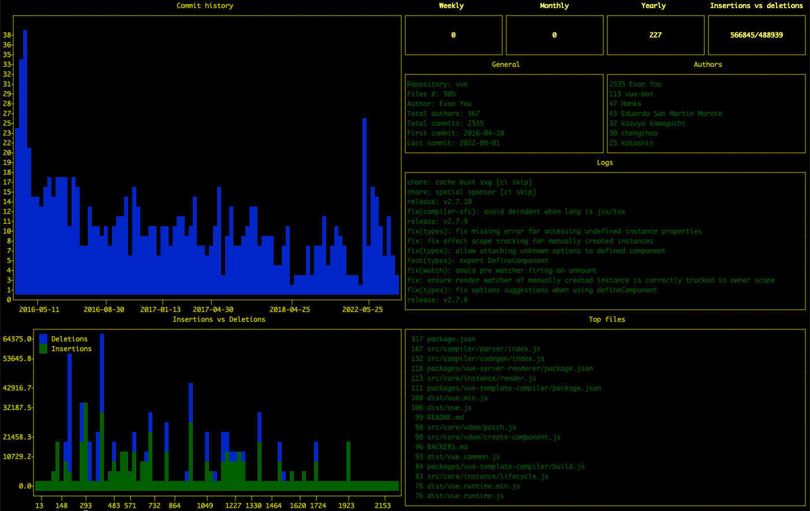

# git_dash

CLI script for generating a git metrics dashboard directly in your terminal.

## Examples

React [Dan Abramov](https://github.com/yyx990803)


Vuejs [Evan You](https://github.com/yyx990803)



# Usage

- Open a terminal, preferably [iterm2](https://iterm2.com/)
- Navigate into your git repository folder
- Execute the following command(s)

Full history

```bash
./git_dash.sh
```

By author

```bash
./git_dash.sh -a githubusername
```

Theme

```bash
./git_dash.sh -t theme
```

Supported options:

```bash
./git_dash.sh -h
```

    Usage: ./git_dash.sh [ -n NAME ] [ -t THEME ]

    Options:
    -a <author>       Git author (optional)
    -t <theme>        Theme (optional, default 'dark'): 'default'|'clear'|'pro'|....'
    -h                Help

## Installation

Pre requisites are Git/Python installed and the following package dependency `plotext`.

If you prefer cloning this repo, setting an alias it is up to you.

Or simply use this

```shell
bash <(curl -sL https://raw.githubusercontent.com/darul75/git_dash/main/git_dash.sh)
```

and then passing parameters:

```shell
bash <(curl -sL https://raw.githubusercontent.com/darul75/git_dash/main/git_dash.sh) -a darul75@gmail.com
```

## Layout


```
##########################################################################################
#                                       #           #           #           #            #
#                                       #   Weekly  #  Monthly  #  Yearly   # Ins vs Del #
#  Graph commit history                 #           #           #           #   (since)  #
#                                       #           #           #           #  beginning #
#                                       ##################################################
#                                       #                       #                        #
#                                       #                       #                        #
#      (since very beginning)           #       General info    #      Top Authors       #
#                                       #                       #                        #
#                                       #                       #      (since beginning) #
#                                       ##################################################
#                                       #                                                #
#                                       #                                                #
#                                       #                  Commit logs                   #
#                                       #                                                #
#                                       #                                                #
#                                       #                   (max 100)                    #
#                                       #                                                #
#                                       #                                                #
#                                       #                                                #
#                                       #                                                #
#                                       #                                                #
##########################################################################################
#                                       #                                                #
#                                       #                                                #
#        Graph Ins vs Del               #                  Top files edited              #
#                                       #                                                #
#         (since very beginning)        #                                                #
##########################################################################################
```

## Credits

Shout to the author of [Plotext](https://github.com/piccolomo/plotext) who helped me a lot adding new features, fixing small issues in a record time.

[Dan Abramov](https://github.com/gaearon) and [Evan You](https://github.com/yyx990803) as I used their respective github repository actvity in React and VueJS repositories as examples. Contact me if you want to get removed.

## Coming

- [ ] since and between date options

